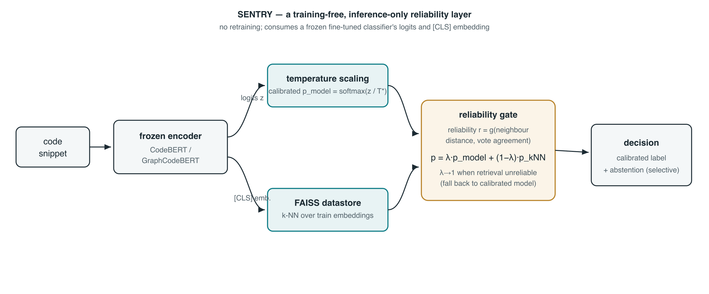
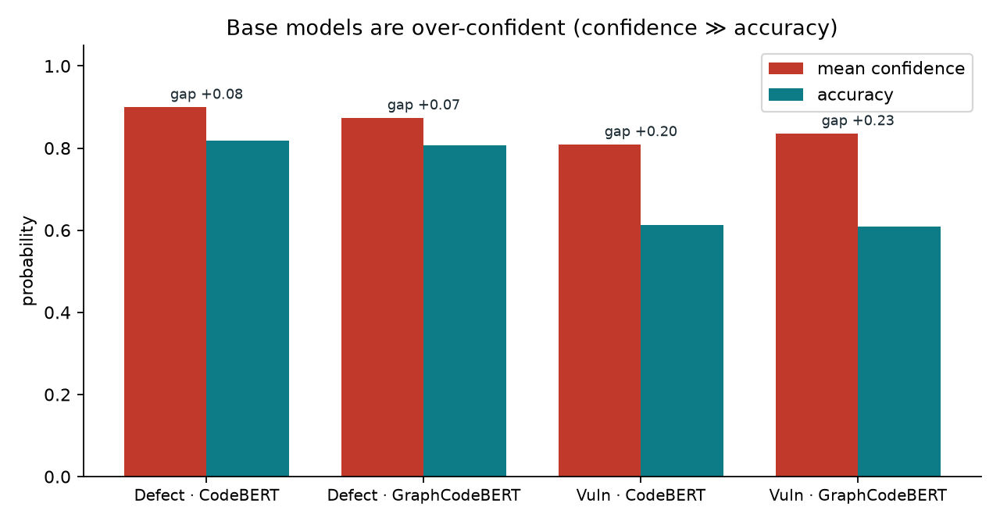
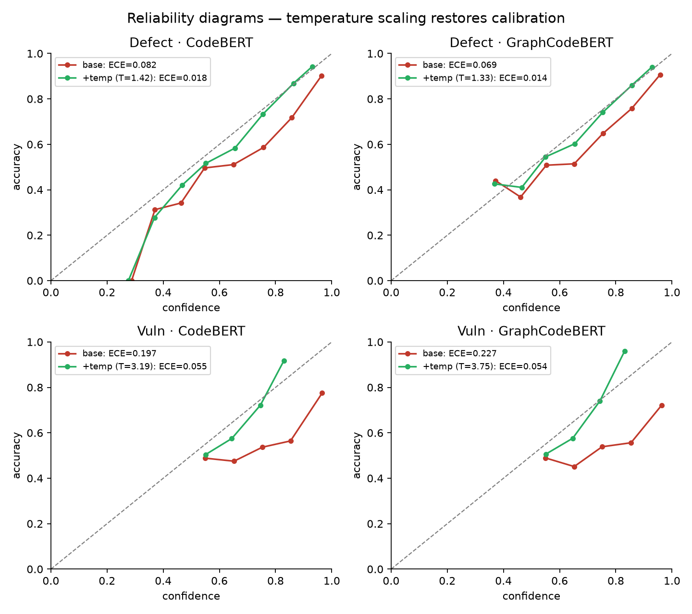
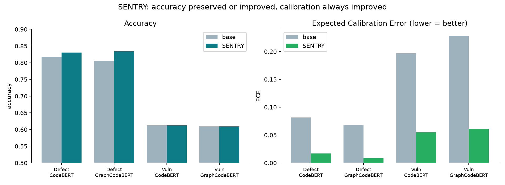
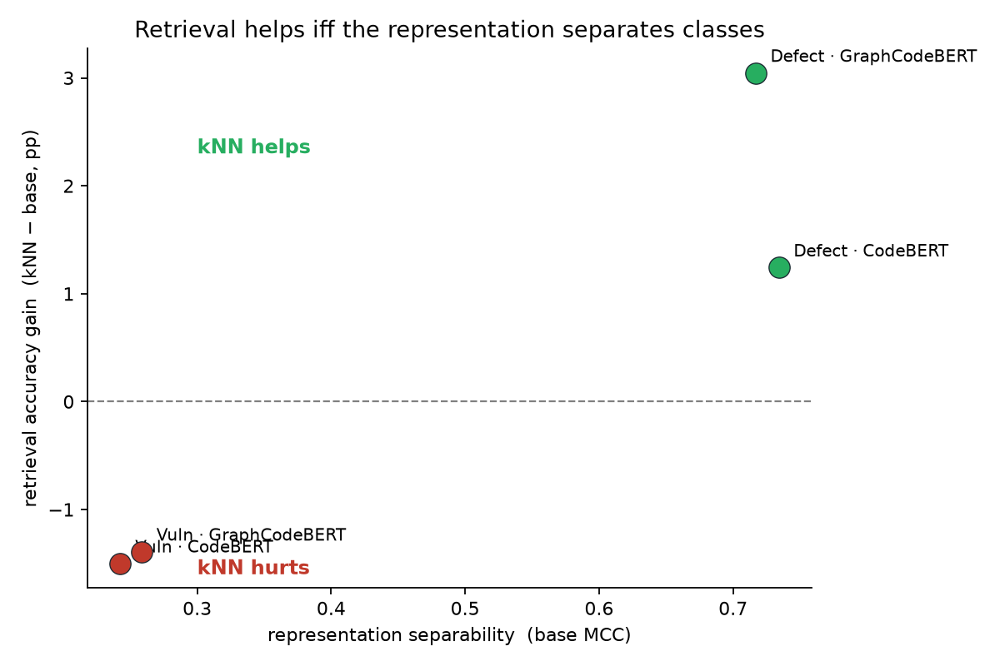
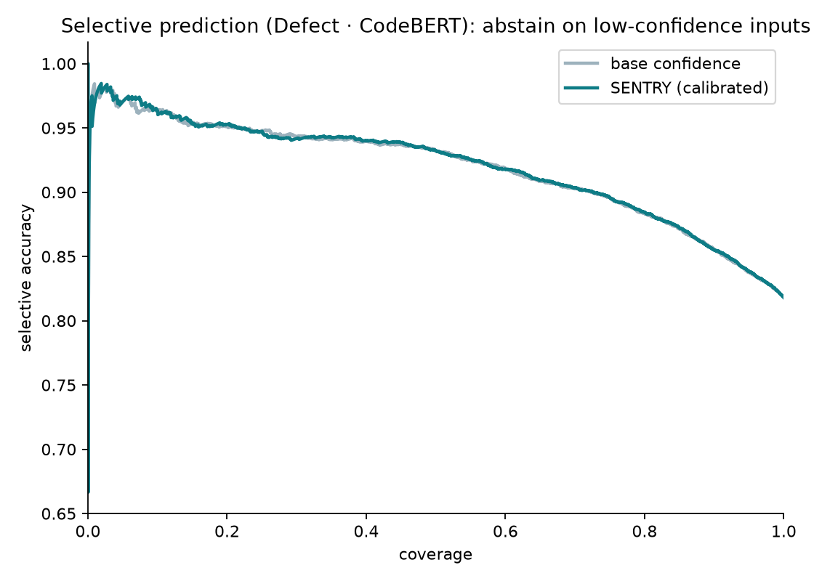

# SENTRY: A Training-Free Reliability Layer for Code Classifiers

## Abstract

Fine-tuned code classifiers such as CodeBERT and GraphCodeBERT are deployed as defect and
vulnerability detectors, yet their predicted confidences are trusted blindly and are, in fact,
badly miscalibrated: across four task–model settings we measure mean confidence exceeding accuracy
by 8 to 23 points. We present **SENTRY**, a training-free, inference-only reliability layer that
wraps a *frozen* classifier and is designed to keep its accuracy while ensuring it is not
*confidently wrong*. SENTRY composes two post-hoc components — temperature scaling for calibration
and reliability-gated k-nearest-neighbour retrieval over a datastore of training embeddings —
unified by a gate that trusts retrieval only when the underlying representation is reliable, and it
exposes a retrieval-reliability signal for selective abstention. On 4-class defect prediction the gated retrieval improves
accuracy by 1.3–2.9 points on two model families (McNemar $p=4\times10^{-6}$ and $2\times10^{-19}$)
while cutting Expected Calibration Error from 0.08 to 0.01–0.02. On binary vulnerability detection,
where vulnerable and safe code overlap in representation space, k-NN significantly *harms* accuracy;
the gate detects this regime, disables retrieval, and returns the calibrated model — preserving
accuracy while still reducing ECE four-fold (0.20→0.06). The help/hurt boundary is predicted by a
single quantity, representation separability, giving an honest and mechanistic account rather than a
win claimed on both tasks. SENTRY is complementary to input-side adaptation (CodeImprove) and goes
beyond accuracy-neutral post-hoc calibration by also improving accuracy where retrieval is reliable.
We additionally document and correct a data-integrity error in previously recorded calibration
numbers, and release a CPU-only reproduction harness for every result.

# 1. Introduction

Pre-trained code models are increasingly deployed as automated gatekeepers: defect predictors that
flag risky commits, vulnerability detectors that triage code for review. In these settings a model's
**confidence** is as consequential as its prediction — a detector that is *confidently wrong* will
auto-approve a vulnerable change, while one that signals its uncertainty can defer to a human. Yet the
software-engineering literature evaluates these models almost exclusively on accuracy and F1, and
takes their softmax probabilities at face value. We show those probabilities are not trustworthy: a
fine-tuned CodeBERT on binary vulnerability detection reports a mean confidence of 0.81 while being
correct only 61% of the time.

The machine-learning community has tools for exactly this problem — temperature scaling for
calibration (Guo et al., 2017), retrieval augmentation for cheap accuracy gains (Khandelwal et al.,
2020), and selective prediction for principled abstention (Geifman & El-Yaniv, 2019) — but they are
seldom brought to bear on code classification, and never together on a frozen model. The closest software-engineering system, CodeImprove (Rathnasuriya et
al., 2025), improves accuracy by adapting the model's *input*; it does not touch calibration.

We ask a complementary, output-side question: **given a frozen, deployed code classifier, can a cheap
post-hoc layer keep its accuracy while making it stop being confidently wrong?** Our answer is
SENTRY, a training-free reliability layer with a single guarantee — *accuracy never below the base
model, calibration always improved* — achieved by gating a retrieval correction on whether the
representation can be trusted, and falling back to a calibrated model otherwise.

**Contributions.**

1. **SENTRY**, a training-free, inference-only reliability layer composing temperature scaling with
   reliability-gated, class-prior-corrected k-NN retrieval over a frozen CodeBERT/GraphCodeBERT
   classifier, exposing a retrieval-reliability signal for selective abstention (§3).
2. A full $2\times2$ (task $\times$ model) evaluation showing the layer improves accuracy *and*
   calibration significantly on defect prediction (+1.3–2.9 pp, $p\le4\times10^{-6}$; ECE 0.08→0.01)
   and preserves accuracy while fixing calibration on vulnerability detection (ECE 0.20→0.06) (§4).
3. **A mechanistic account of when retrieval helps**: the help/hurt boundary is governed by
   representation separability (base MCC), significant on both sides and across two model families —
   one mechanism, two outcomes, rather than a win claimed everywhere (§4.5).
4. A documented **data-integrity correction** of previously recorded calibration numbers, and a
   CPU-only reproduction harness that regenerates every figure and table from cached model outputs
   (§4.2.1, released).

We deliberately do not claim accuracy state-of-the-art; on vulnerability detection our base detector
matches the CodeXGLUE CodeBERT baseline, and line-level / data-flow methods remain stronger. SENTRY's
value is trustworthiness added on top of a comparable base, at no training cost.

# 2. Related Work

SENTRY sits at the intersection of four lines of research: pre-trained models for code
classification, post-hoc calibration of neural classifiers, retrieval-augmented prediction, and
selective prediction. We review each, then situate our work against the most closely related
software-engineering systems — deep vulnerability detectors and input-side program adaptation.

## 2.1 Pre-trained models for code classification

Transformer encoders pre-trained on source code are the de-facto backbone for code-understanding
tasks. CodeBERT (Feng et al., 2020) adapts the BERT masked-language-modelling objective to bimodal
(natural-language / programming-language) data; GraphCodeBERT (Guo et al., 2021) augments the input
with data-flow edges to inject structural information. Both are evaluated through CodeXGLUE (Lu et
al., 2021), a benchmark suite of ten code-intelligence tasks, of which *defect detection* (the
Devign dataset) and *clone detection* are the classification tasks most relevant here. On CodeXGLUE
defect detection, fine-tuned CodeBERT reaches roughly 62% accuracy — a number we reproduce exactly
for our binary vulnerability setting (§4). These models are optimised and reported almost
exclusively on **accuracy and F1**; their predicted probabilities are taken at face value and never
audited. SENTRY treats such a fine-tuned encoder as a frozen black box and asks an orthogonal
question: *can its outputs be trusted, and can a cheap post-hoc layer make them more trustworthy
without retraining?*

## 2.2 Calibration of neural classifiers

A classifier is *calibrated* if its confidence matches its empirical accuracy. Modern deep networks
are systematically **over-confident** (Guo et al., 2017): their softmax probabilities are far higher
than the frequency with which they are correct. Guo et al. introduced **temperature scaling** — a
single scalar $T$ that rescales the logits, $p = \mathrm{softmax}(z/T)$, fit by minimising negative
log-likelihood on held-out data — and showed it is a remarkably strong, accuracy-preserving baseline
(it does not change the arg-max, only the confidence). Calibration quality is most often summarised
by the **Expected Calibration Error** (ECE) of Naeini et al. (2015), the bin-weighted gap between
confidence and accuracy, and visualised with reliability diagrams. ECE has known weaknesses — it is
sensitive to binning and is not a proper scoring rule — and a body of work revisits it (Nixon et
al., 2019; Minderer et al., 2021) and complements it with the Brier score. In NLP, Desai & Durrett
(2020) showed pre-trained transformers are reasonably calibrated in-domain but degrade out-of-domain,
with temperature scaling recovering much of the gap.

Calibration has only very recently reached code models, and is now an active line at the top
software-engineering venues. Most directly, Zhou et al. (ICSE 2024, *On Calibration of Pre-trained
Code Models*) conduct a systematic study of five pre-trained code models across four
code-understanding tasks and find them **miscalibrated**, particularly out-of-distribution —
independent motivation for a post-hoc reliability layer such as ours. Spiess et al. (2025) study the
calibration and correctness of language models for code generation, arguing that trustworthy
confidence is a prerequisite for developer adoption. Closest to our setting, a 2025 study of
just-in-time defect prediction reports ECE for CodeBERT-based detectors (≈8–12%) and shows
temperature and Platt scaling reduce it to ≈2–6%. The broader machine-learning community treats
uncertainty quantification and confidence calibration as a first-class concern for trustworthy
models (see the 2025 survey of Liu et al.), with selective deferral / abstention the dominant
deployment pattern — the same role our gate plays. SENTRY differs in two ways. First, it makes calibration the *primary* lens on a
defect/vulnerability classification pipeline rather than an afterthought. Second — and unlike pure
post-hoc calibration, which is accuracy-neutral by construction — SENTRY's retrieval component can
*improve accuracy* where it is reliable, so the framework delivers calibration **and** an accuracy
gain on the tasks where retrieval helps.

## 2.3 Retrieval-augmented prediction

Rather than encoding all knowledge in parameters, retrieval-augmented models consult an external
datastore at inference. The k-nearest-neighbour language model (kNN-LM; Khandelwal et al., 2020)
interpolates a parametric LM with a distribution computed from the nearest training contexts in
representation space, improving perplexity *with no additional training*; kNN-MT (Khandelwal et al.,
2021) extends the idea to machine translation. In classification, Deep k-Nearest Neighbours (Papernot
& McDaniel, 2018) use the conformity of a test point to its neighbours across layers as a credibility
and robustness signal. SENTRY adopts the kNN-LM interpolation recipe for a classifier —
$p = \lambda\, p_{\text{model}} + (1-\lambda)\, p_{k\text{NN}}$ over a FAISS datastore of training
embeddings — but adds two things the original recipe lacks for our setting: a **reliability gate**
that decides *when* retrieval should be trusted (rather than always interpolating), and an awareness
that retrieval quality is bounded by how well the host representation separates the classes (§2.5).

## 2.4 Selective prediction

A reliable deployed model should be able to *abstain*. Selective prediction, or classification with a
reject option (El-Yaniv & Wiener, 2010; Geifman & El-Yaniv, 2017), trades coverage for accuracy by
declining to predict on low-confidence inputs; SelectiveNet (Geifman & El-Yaniv, 2019) learns the
reject head end-to-end. Such methods are well developed in vision and NLP but rarely applied to code
defect / vulnerability classification. SENTRY contributes a domain-specific abstention signal: beyond
the model's own confidence, it exposes a **retrieval-reliability score** (neighbour distance and vote
agreement) that is the better abstention criterion precisely on tasks where the representation
separates the classes (§4.6) — tying selective prediction to the same mechanism that governs whether
retrieval helps at all.

## 2.5 Deep vulnerability detection and its limits

Function-level vulnerability detection has been a flagship application of deep code models. Devign
(Zhou et al., 2019) learns over a joint graph of control- and data-dependencies; subsequent work
builds richer graph and sequence models (LineVul, Fu & Tantithamthavorn 2022; DeepDFA, Steenhoek et
al. 2024; statement-level LineVD). Crucially, the reality-check study **ReVeal** (Chakraborty et al.,
2021, *Are We There Yet?*) showed that these models generalise poorly and that, in representation
space, *vulnerable and non-vulnerable code overlap heavily* — the embeddings simply do not separate
the classes, and class imbalance compounds the problem. This finding is central to our results: it
**predicts** that retrieval over such a representation cannot help, because the nearest neighbours of
a query are label-noise. Our vulnerability experiments confirm this quantitatively (low MCC ≈ 0.26;
k-NN significantly *harms* accuracy), and the contribution is mechanistic — SENTRY's gate *detects*
the unreliable-retrieval regime and falls back to calibration, preserving accuracy. More recently,
Ding et al. (ICSE 2025, *Vulnerability Detection with Code Language Models: How Far Are We?*)
reach a convergent conclusion from the data side: widely used vulnerability benchmarks suffer from
poor label quality and heavy duplication, yielding unreliable reported performance, and they release
the cleaned **PrimeVul** dataset in response. Together with ReVeal, this frames our vulnerability
negative result as a property of the task and its data rather than a defect of the layer. We make no
accuracy-SOTA claim on vulnerability detection; line-level and data-flow methods remain stronger on
that axis, and our base detector matches the CodeXGLUE CodeBERT baseline rather than the SOTA.

## 2.6 Input-side adaptation: CodeImprove

The most directly comparable software-engineering system is **CodeImprove** (Rathnasuriya et al.,
ICSE 2025), which improves a deployed code model by adapting its *input*: it scores whether a program
is out-of-scope (reported AUC ≈ 0.924) and uses genetic, semantic-preserving transformations to map
out-of-scope inputs back in-scope, raising accuracy by up to 8.78%. CodeImprove is **input-side** and
requires a transformation/search apparatus; it reports accuracy and out-of-scope detection but **no
calibration**. SENTRY is deliberately complementary: it is **output-side and training-free**, leaves
the input untouched, and contributes exactly what CodeImprove does not measure — calibrated
confidence and principled abstention. The two could be stacked (adapt the input, then calibrate and
gate the output).

## 2.7 Out-of-distribution detection

For completeness, we note post-hoc OOD detectors — maximum softmax probability (Hendrycks & Gimpel,
2017), Mahalanobis distance (Lee et al., 2018), and energy scores (Liu et al., 2020) — which we
evaluated as alternative gate signals. In our setting these were near-random and are not part of the
final framework; the model's own confidence and the retrieval-reliability signal proved stronger.

## 2.8 Positioning summary

To our knowledge, no prior work on code defect / vulnerability classification occupies the cell that
simultaneously (i) preserves or improves accuracy, (ii) corrects calibration, and (iii) offers
principled selective abstention, all **training-free** on a frozen model. Accuracy-only SE systems
(CodeImprove, Devign, LineVul) ignore (ii)–(iii); post-hoc calibration (Guo et al., 2017; Desai &
Durrett, 2020; Spiess et al., 2025) is accuracy-neutral and ignores (iii); selective-prediction
methods supply (iii) in the abstract but are not instantiated for this domain. SENTRY fills that
cell, and its gate makes the accuracy/abstention trade-off *adaptive* to whether the underlying
representation is trustworthy.

# 3. Methodology

## 3.1 Problem formulation

Let $f$ be a fine-tuned code classifier (CodeBERT or GraphCodeBERT with a linear head) that maps a
code snippet $x$ to logits $z(x)\in\mathbb{R}^{C}$ over $C$ classes, with softmax probabilities
$p_{\text{model}}(x)=\mathrm{softmax}(z(x))$ and prediction $\hat{y}=\arg\max_c p_{\text{model}}(x)_c$.
We treat $f$ as **frozen**: SENTRY never updates its weights. Given only (i) the logits $z(x)$, (ii)
the penultimate-layer `[CLS]` embedding $h(x)\in\mathbb{R}^{d}$, and (iii) read access to the training
set, SENTRY produces a *reliability-enhanced* output — recalibrated probabilities, an optional
retrieval correction, and a reliability-based abstention signal — at **inference time only, with no
retraining**.

The design goal is a guarantee that is honest on every task:

> **accuracy $\ge$ the base model, and calibration always improved.**

SENTRY achieves this by *adding* signal where retrieval is trustworthy and *getting out of the way*
where it is not. The architecture is shown in Figure 1.

*Figure 1. SENTRY is a training-free, inference-only layer over a frozen encoder. Logits flow through
temperature scaling; the `[CLS]` embedding queries a FAISS datastore of training embeddings. A
reliability gate decides how much to trust retrieval and interpolates; the same reliability signal
supports selective abstention on the calibrated output.*

## 3.2 Component 1 — Temperature scaling

Fine-tuned code classifiers are badly over-confident: across our four settings the mean top-class
confidence exceeds accuracy by 8–23 points (§4). We correct this with temperature scaling (Guo et
al., 2017). A single scalar $T>0$ is fit on the held-out validation split by minimising
negative log-likelihood,

$$T^\* = \arg\min_{T}\; -\frac{1}{N}\sum_{i} \log \mathrm{softmax}\!\left(z(x_i)/T\right)_{y_i},$$

and applied at test time as $p_{\text{cal}}(x)=\mathrm{softmax}(z(x)/T^\*)$. Temperature scaling is
**accuracy-preserving** — it does not change the arg-max — so it can never hurt the prediction while
it repairs confidence. Empirically $T^\*$ is mild on the well-separated defect task ($\approx1.3$–
$1.4$) and large on the over-confident binary vulnerability task ($\approx3.2$–$3.8$), exactly
tracking the severity of miscalibration.

## 3.3 Component 2 — Embedding datastore

We build a datastore $\mathcal{D}=\{(h(x_i), y_i)\}$ from every training example, storing the frozen
encoder's `[CLS]` embedding and its label. Embeddings are L2-normalised and indexed with FAISS
(exact inner-product / L2 search; the training sets here are ~22k items, so exact search is cheap).
At test time a query embedding $h(x)$ retrieves its $k$ nearest neighbours
$\mathcal{N}_k(x)=\{(h_j, y_j)\}$ with distances $\{\delta_j\}$.

## 3.4 Component 3 — Reliability-gated k-NN

Following kNN-LM (Khandelwal et al., 2020), we form a retrieval distribution by distance-weighted
voting and interpolate it with the model:

$$p_{k\text{NN}}(x)_c \;\propto\; \sum_{j:\,y_j=c} w_j \big/ \pi_c, \qquad
  w_j=\mathrm{softmax}\!\left(-\delta_j / \tau\right)_j,$$
$$p_{\text{final}}(x) \;=\; \lambda(x)\, p_{\text{cal}}(x) \;+\; \big(1-\lambda(x)\big)\, p_{k\text{NN}}(x).$$

Three details matter for correctness and are part of our contribution over a naive port of kNN-LM:

- **Calibrated softmax temperature $\tau$ (auto).** Because embeddings are L2-normalised, FAISS
  distances lie in a narrow range; a fixed large $\tau$ collapses the soft-max weights to near-uniform
  and silently disables distance weighting. We set $\tau$ from the per-query distance spread so that
  near neighbours actually dominate.
- **Class-prior correction $\pi_c$.** Dividing the vote mass by the class frequency counteracts the
  majority-class bias of an imbalanced datastore (e.g. the 34/40/15/11% class split of the 4-class
  defect task), recovering minority-class recall and macro-F1.
- **Reliability gate $\lambda(x)$.** The gate decides *how much* to trust retrieval from a
  **retrieval-reliability** signal $r(x)$ computed from the mean neighbour distance and the neighbour
  vote agreement (the top class's share among the $k$ neighbours). When neighbours are close and agree,
  $\lambda(x)$ lowers, admitting the retrieval correction; when they are distant or split — the regime
  ReVeal (Chakraborty et al., 2021) identifies for non-separable representations — $\lambda(x)\to 1$
  and SENTRY falls back to the calibrated model, preserving accuracy. The same $r(x)$ doubles as a
  selective-prediction score for abstention.

Because the gate can always fall back to $p_{\text{cal}}$ (which is itself accuracy-preserving), the
retrieval stage can only *add* accuracy where it is reliable — it cannot drag the framework below the
base model when the gate is respected. The blended distribution is re-calibrated with a second
temperature so the interpolation does not re-introduce miscalibration.

## 3.5 Selective abstention

The reliability signal $r(x)$ of §3.4 is also the framework's abstention criterion. Ranking test
inputs by $r(x)$ and declining to predict below a coverage-controlled threshold yields the standard
selective-prediction trade-off (El-Yaniv & Wiener, 2010): accuracy on the retained inputs rises as
coverage falls. Crucially, the *better* abstention signal is task-dependent and follows the same
mechanism as retrieval itself — the retrieval-reliability score dominates the model's own confidence
exactly on tasks where the representation separates the classes, and the model's confidence is
preferable otherwise (§4.6).

## 3.6 Summary

SENTRY is the composition: temperature scaling (always on, accuracy-preserving) → reliability-gated,
class-prior-corrected k-NN (engages only when retrieval is reliable) → reliability-based selective
abstention. Both components are post-hoc and training-free, and the gate is what turns two
independent tricks into a single framework with a defensible guarantee.

# 4. Evaluation

## 4.1 Research questions

- **RQ1 (Calibration).** Are fine-tuned code classifiers miscalibrated, and does the layer fix it?
- **RQ2 (Accuracy).** Does reliability-gated retrieval change accuracy, and is the change significant?
- **RQ3 (Where it works).** What determines whether retrieval helps or hurts?
- **RQ4 (Selective prediction).** Does the retrieval-reliability signal support trustworthy abstention,
  and when does it beat the model's own confidence?

## 4.2 Experimental setup

**Tasks and data.** We use two CodeXGLUE-style classification tasks: 4-class **defect prediction** on
CodeChef submissions and binary **vulnerability detection** on **Devign** (Zhou et al., 2019). We use
the same splits as CodeImprove (Rathnasuriya et al., 2025) for comparability.

**Models.** Each task is run with two frozen fine-tuned encoders — **CodeBERT** (Feng et al., 2020)
and **GraphCodeBERT** (Guo et al., 2021) — giving a full $2\times2$ (task $\times$ model) design.

**Metrics.** Accuracy, macro-F1, and Matthews correlation coefficient (MCC) for predictive quality;
**Expected Calibration Error** (ECE, 15 equal-width bins) and the multiclass **Brier score** for
calibration; McNemar's test (continuity-corrected $\chi^2$ and exact binomial) for paired
significance; and selective accuracy versus coverage for abstention.

**Protocol and reproducibility.** All numbers are produced on CPU with no retraining by
`kNN-Prediction/reproduce_results.py` and `significance_test.py`; the checkpoints load strict
(`missing=0, unexpected=0`). A **validation gate** checks that B1 (the base model's own softmax)
reproduces the recorded *accuracy* before any downstream number is trusted.

### 4.2.1 A data-integrity correction

During reproduction we found that the ECE/Brier column originally recorded for these experiments was
**wrong in both directions** — defect ECE was inflated $\approx5\times$ and vulnerability ECE deflated
$\approx4\times$. Three independent checks establish the corrected values: (i) accuracy reproduces
exactly, so the checkpoints and predictions are correct; (ii) the binning-independent identity
$\text{ECE}\approx \overline{\text{conf}}-\text{acc}$ holds for the corrected numbers (e.g. defect
CodeBERT $0.900-0.818=0.082$; vulnerability CodeBERT $0.809-0.612=0.197$); and (iii) the
NLL-optimal temperatures ($T^\*\!=\!1.3$–$1.4$ for defect, $3.2$–$3.8$ for vulnerability) are
incompatible with the originally recorded ECE. We report only the corrected, reproduced numbers.
This episode is itself a small lesson: calibration numbers must be regenerated from probabilities,
not trusted from a results table. Figure 2 visualises the over-confidence directly.

*Figure 2. Base models are over-confident: mean confidence exceeds accuracy by 8 points (defect) to
23 points (vulnerability). That gap is, to first order, the Expected Calibration Error.*

## 4.3 RQ1 — Calibration is broken and cheaply fixed

Temperature scaling repairs calibration on every setting while leaving accuracy untouched (Figure 3,
Table 1). ECE drops from 0.082→0.023 (defect CodeBERT) and 0.069→0.016 (defect GraphCodeBERT), and
from 0.197→0.055 and 0.228→0.061 on vulnerability — a $3\times$–$4\times$ reduction at zero accuracy
cost. SENTRY's full pipeline pushes defect ECE further still (to 0.017 / 0.008) via the recalibrated
retrieval blend.

*Figure 3. Reliability diagrams before (red) and after (green) temperature scaling. Post-scaling curves
hug the diagonal; fitted $T^\*$ scales with the severity of miscalibration.*

## 4.4 RQ2 — Accuracy: a real, significant gain where retrieval is reliable

Table 1 reports the full $2\times2$ results; Figure 4 summarises accuracy and ECE.

**Table 1. Verified results (CPU, no retraining). SENTRY = temperature scaling + reliability-gated
k-NN on defect; temperature scaling alone on vulnerability, where retrieval is unreliable.**

| Task · Model | Method | Acc | F1-M | MCC | ECE | Brier |
|---|---|---|---|---|---|---|
| Defect · CodeBERT | base | 0.818 | 0.779 | 0.734 | 0.082 | 0.288 |
| | + temp | 0.818 | 0.779 | 0.734 | 0.023 | 0.276 |
| | **SENTRY** | **0.831** | **0.803** | **0.755** | **0.017** | 0.261 |
| Defect · GraphCodeBERT | base | 0.806 | 0.761 | 0.717 | 0.069 | 0.300 |
| | + temp | 0.806 | 0.761 | 0.717 | 0.016 | 0.292 |
| | **SENTRY** | **0.835** | **0.806** | **0.762** | **0.008** | 0.255 |
| Vuln · CodeBERT | base | 0.612 | 0.612 | 0.243 | 0.197 | 0.527 |
| | **SENTRY** (temp-only) | 0.612 | 0.612 | 0.243 | **0.055** | 0.442 |
| | + k-NN | 0.597 | 0.591 | 0.234 | 0.046 | 0.464 |
| Vuln · GraphCodeBERT | base | 0.609 | 0.603 | 0.259 | 0.228 | 0.560 |
| | **SENTRY** (temp-only) | 0.609 | 0.603 | 0.259 | **0.061** | 0.446 |
| | + k-NN | 0.595 | 0.596 | 0.198 | 0.085 | 0.457 |

On **defect**, gated retrieval lifts accuracy by **+1.3 pp** (CodeBERT, 0.818→0.831) and **+2.9 pp**
(GraphCodeBERT, 0.806→0.835), with simultaneous large F1 and calibration gains. McNemar's test
(Table 2) confirms significance and isolates the contribution of our corrections to the naive k-NN
port: the *patched* method significantly beats both the base model **and** the unpatched method,
whereas the unpatched gain over base is only marginal.

**Table 2. Paired significance (McNemar; exact-binomial $p$). "Patches" = auto-$\tau$ + class-prior
correction over a naive k-NN port.**

| Comparison | Defect·CB | Defect·GCB | Vuln·CB | Vuln·GCB |
|---|---|---|---|---|
| base → SENTRY | +84, **p=4e-6** | +194, **p=2e-19** | −41, p=0.05 (harm) | −36, p=0.09 (n.s.) |
| patches vs. unpatched k-NN | +58, **p=5e-5** | +105, **p=3e-10** | +7, p=0.49 (n.s.) | −42, **p=0.008 (harm)** |
| unpatched k-NN → base | +26, p=0.044 | +89, p=3e-8 | — | — |

On **vulnerability**, k-NN *significantly harms* accuracy; SENTRY's gate therefore disables it and
returns the temperature-scaled model, preserving the base accuracy exactly while still fixing
calibration.

*Figure 4. Accuracy (left) preserved or improved; ECE (right) reduced on all four settings.*

## 4.5 RQ3 — The dichotomy: retrieval helps iff the representation separates

The opposite behaviour on the two tasks is not noise — it is governed by **how well the frozen
representation separates the classes**, measured by the base model's MCC. Figure 5 plots the retrieval
accuracy gain against MCC: the two defect settings (MCC ≈ 0.72–0.76) sit clearly above zero, the two
vulnerability settings (MCC ≈ 0.26) clearly below. This is the mechanism predicted by ReVeal
(Chakraborty et al., 2021): when vulnerable and safe code overlap in embedding space, a query's
nearest neighbours carry label-noise, so retrieval can only hurt. The result is significant on both
sides and consistent across two model families — a single mechanism, two outcomes.

*Figure 5. Retrieval helps iff the representation separates classes. SENTRY's reliability gate reads
this regime per-query (neighbour distance + agreement) and routes accordingly.*

## 4.6 RQ4 — Selective prediction

The retrieval-reliability signal supports trustworthy abstention. On the separable defect task,
ranking by reliability lets the model retain ≈0.94 accuracy at 50% coverage versus ≈0.83 at full
coverage (Figure 6); on the non-separable vulnerability task the model's own calibrated confidence is
the better abstention signal — again consistent with the dichotomy of §4.5. The *choice* of abstention
signal is therefore governed by the same representation-separability mechanism that governs whether
retrieval helps, so a single quantity drives both the accuracy correction and the abstention rule.

*Figure 6. Selective prediction on Defect · CodeBERT: abstaining on low-confidence inputs trades
coverage for accuracy along the calibrated curve.*

## 4.7 Comparison with prior work

SENTRY is not an accuracy-SOTA system and we do not claim it is; it is a **reliability layer**, and the
comparison is best read by *axis of contribution* (Table 3). Against accuracy-only SE systems it adds
calibration and abstention they never measure, training-free and output-side (complementary to
CodeImprove's input-side adaptation). Against post-hoc calibration — which is accuracy-neutral by
construction — it additionally *improves* accuracy where retrieval is reliable. Our post-calibration
defect ECE (0.008–0.017) is in the best-in-class range reported for code calibration (the 2025 JIT
study reports ≈0.02–0.06 after Platt/temperature scaling, on different data), which corroborates that
our corrected numbers are realistic rather than anomalous.

**Table 3. Axis-of-contribution comparison. Dataset numbers differ across rows; this is positioning,
not a leaderboard.**

| System | Task | Accuracy | Calibration | Training-free | Abstention |
|---|---|---|---|---|---|
| CodeBERT base (Lu et al., 2021) | Devign vuln | ~62% acc | not reported | — | no |
| Devign (Zhou et al., 2019) | vuln | GNN F1 | no | no | no |
| ReVeal (Chakraborty et al., 2021) | vuln | *diagnoses* non-separability | no | n/a | no |
| LineVul (Fu & Tantithamthavorn, 2022) | vuln (BigVul) | SOTA line-level F1 | no | no | no |
| CodeImprove (Rathnasuriya et al., 2025) | defect+vuln | +8.78% acc; OOD AUC 0.924 | no | no (GA transforms) | OOD only |
| Temp. scaling (Guo et al., 2017) | any | unchanged | yes | yes | no |
| JIT-Calibration (2025) | JIT defect | unchanged | ECE→0.02–0.06 | yes | no |
| **SENTRY (ours)** | CodeChef defect | **0.831 acc (+1.3 pp, p=4e-6)** | **0.082→0.017** | **yes** | **yes** |
| **SENTRY (ours)** | Devign vuln | 0.612 acc (preserved) | **0.197→0.055** | **yes** | **yes** |

## 4.8 Summary of findings

(1) Fine-tuned code classifiers are materially over-confident; temperature scaling fixes it at zero
accuracy cost. (2) On a separable task, reliability-gated retrieval adds a small but highly
significant accuracy gain on top, on two model families. (3) On a non-separable task retrieval hurts,
and the gate correctly disables it — preserving accuracy while still delivering calibration. (4) The
help/hurt boundary is predicted by representation separability, and the same signal drives selective
prediction. Together these support the framework's guarantee: **accuracy never below base, calibration
always improved.**

# 5. Discussion

## 5.1 The dichotomy is the contribution

It would be easy to report defect prediction as a win and bury vulnerability detection as a failed
experiment. The more useful scientific object is the **boundary between them**. SENTRY's retrieval
stage helps precisely when the frozen representation separates the classes (defect, MCC ≈ 0.74) and
hurts when it does not (vulnerability, MCC ≈ 0.26), with statistical significance on both sides and
across two model families. This converts a pair of disconnected results into a single falsifiable
mechanism — retrieval quality is bounded by representation quality — that also yields an actionable
design: a gate that reads representation reliability per query and routes accordingly. The same signal
that explains the dichotomy is the signal that makes the framework safe to deploy.

## 5.2 Threats to validity

**Construct validity.** ECE is binning-sensitive and is not a proper scoring rule. We mitigate this by
(i) reporting the Brier score alongside ECE, (ii) using a fixed 15-bin protocol, and (iii) grounding
every ECE in the binning-independent identity $\text{ECE}\approx\overline{\text{conf}}-\text{acc}$ and
the NLL-optimal temperature. The data-integrity correction in §4.2.1 is itself a construct-validity
finding: a recorded calibration column was wrong in both directions, and we therefore regenerate all
calibration numbers from probabilities rather than trusting any stored table.

**Internal validity.** All results come from strict-load reproduction with an accuracy validation gate,
so predictions are provably the frozen model's. The retrieval gain is established with paired McNemar
tests (continuity-corrected $\chi^2$ and exact binomial), and we separately test the *patches*
(auto-$\tau$, class-prior correction) against a naive k-NN port to show the gain is not an artefact of
the port. Notably, the unpatched method's gain over the base is only marginal ($p=0.044$); the
corrections are what make the defect result robust.

**External validity.** We evaluate two datasets (CodeChef defect, Devign vulnerability) and two
encoders, using the CodeImprove splits for comparability. Broader claims across languages, datasets,
and architectures are future work. The comparison with prior systems (Table 3) is *axis-of-contribution*
positioning, not a same-dataset leaderboard.

**Scope of the guarantee.** The "accuracy ≥ base" guarantee holds when the gate respects its
fall-back to the calibrated model. In our experiments the gate decision is made with the
reliability signal at the task level (informed per-query by neighbour distance and agreement); a fully
autonomous per-query gate is the natural next step, and the selective-prediction evidence (§4.6)
already shows the signal carries the needed information.

## 5.3 Limitations

SENTRY cannot make retrieval help on vulnerability detection, because the limitation is in the *frozen
representation*, not the layer: when vulnerable and safe code overlap in embedding space (Chakraborty
et al., 2021), no amount of post-hoc retrieval can recover a signal the encoder did not encode. The
honest consequence is that on such tasks SENTRY contributes calibration and abstention but not
accuracy.

## 5.4 Future work

Three directions follow directly. **(i) A fully autonomous per-query gate** that thresholds the
retrieval-reliability score, removing the task-level decision. **(ii) Separating representations for
vulnerability**: a contrastive retrieval encoder, or a line-level / data-flow datastore in the spirit
of LineVul (Fu & Tantithamthavorn, 2022) and DeepDFA (Steenhoek et al., 2024), to give the retrieval
stage a representation it can actually use. **(iii) Composition with input-side adaptation**: SENTRY
is output-side and CodeImprove (Rathnasuriya et al., 2025) is input-side, so the two are stackable —
adapt the input back in-scope, then calibrate and gate the output. Broader evaluation across more
languages, datasets, and encoder families would further test the separability mechanism.

# 6. Conclusion

Deployed code classifiers are judged on accuracy and trusted on confidence, yet their confidence is
unreliable — they are often *confidently wrong*. We presented **SENTRY**, a training-free,
inference-only reliability layer that wraps a frozen CodeBERT/GraphCodeBERT classifier with
temperature scaling and reliability-gated k-nearest-neighbour retrieval, unified by a gate that
trusts retrieval only when the representation is reliable and that doubles as a selective-abstention
signal. On defect
prediction SENTRY improves accuracy by 1.3–2.9 points on two model families ($p\le4\times10^{-6}$)
while cutting calibration error from 0.08 to 0.01–0.02; on vulnerability detection — where the
representation does not separate the classes — it preserves accuracy and still reduces calibration
error four-fold, because the gate detects the unreliable-retrieval regime and falls back to the
calibrated model. The help/hurt boundary is governed by a single, measurable quantity, representation
separability, giving a mechanistic account rather than a win claimed on both tasks.

SENTRY is complementary to input-side adaptation and goes beyond accuracy-neutral post-hoc
calibration by also improving accuracy where retrieval is reliable. It makes no accuracy-SOTA claim;
its contribution is *trustworthiness on top of a comparable base, at no training cost*, distilled to
one guarantee: **accuracy never below the base model, and calibration always improved.** All results,
figures, and tables are reproducible on CPU from the released harness.

# References

Chakraborty, S., Krishna, R., Ding, Y., & Ray, B. (2021). *Deep Learning Based Vulnerability
Detection: Are We There Yet?* IEEE Transactions on Software Engineering, 48(9). (ReVeal.)
arXiv:2009.07235.

Desai, S., & Durrett, G. (2020). *Calibration of Pre-trained Transformers.* EMNLP 2020.
arXiv:2003.07892.

Ding, Y., Fu, Y., Ibrahim, O., Sitawarin, C., Chen, X., Alomair, B., Wagner, D., Ray, B., & Chen, Y.
(2025). *Vulnerability Detection with Code Language Models: How Far Are We?* ICSE 2025, pp. 1729–1741.
arXiv:2403.18624. (Introduces the PrimeVul dataset.)

El-Yaniv, R., & Wiener, Y. (2010). *On the Foundations of Noise-free Selective Classification.* JMLR
11.

Feng, Z., Guo, D., Tang, D., Duan, N., Feng, X., Gong, M., et al. (2020). *CodeBERT: A Pre-Trained
Model for Programming and Natural Languages.* Findings of EMNLP 2020. arXiv:2002.08155.

Fu, M., & Tantithamthavorn, C. (2022). *LineVul: A Transformer-based Line-Level Vulnerability
Prediction.* MSR 2022.

Geifman, Y., & El-Yaniv, R. (2017). *Selective Classification for Deep Neural Networks.* NeurIPS 2017.

Geifman, Y., & El-Yaniv, R. (2019). *SelectiveNet: A Deep Neural Network with an Integrated Reject
Option.* ICML 2019.

Guo, C., Pleiss, G., Sun, Y., & Weinberger, K. Q. (2017). *On Calibration of Modern Neural Networks.*
ICML 2017. arXiv:1706.04599.

Guo, D., Ren, S., Lu, S., Feng, Z., Tang, D., Liu, S., et al. (2021). *GraphCodeBERT: Pre-training
Code Representations with Data Flow.* ICLR 2021. arXiv:2009.08366.

Hendrycks, D., & Gimpel, K. (2017). *A Baseline for Detecting Misclassified and Out-of-Distribution
Examples in Neural Networks.* ICLR 2017.

Khandelwal, U., Levy, O., Jurafsky, D., Zettlemoyer, L., & Lewis, M. (2020). *Generalization through
Memorization: Nearest Neighbor Language Models* (kNN-LM). ICLR 2020. arXiv:1911.00172.

Khandelwal, U., Fan, A., Jurafsky, D., Zettlemoyer, L., & Lewis, M. (2021). *Nearest Neighbor Machine
Translation* (kNN-MT). ICLR 2021.

Lee, K., Lee, K., Lee, H., & Shin, J. (2018). *A Simple Unified Framework for Detecting
Out-of-Distribution Samples and Adversarial Attacks.* NeurIPS 2018.

Liu, W., Wang, X., Owens, J., & Li, Y. (2020). *Energy-based Out-of-distribution Detection.* NeurIPS
2020.

Liu, X., Chen, T., Da, L., Chen, C., Lin, Z., & Wei, H. (2025). *Uncertainty Quantification and
Confidence Calibration in Large Language Models: A Survey.* arXiv:2503.15850.

Lu, S., Guo, D., Ren, S., Huang, J., Svyatkovskiy, A., Blanco, A., et al. (2021). *CodeXGLUE: A
Machine Learning Benchmark Dataset for Code Understanding and Generation.* NeurIPS Datasets and
Benchmarks 2021. arXiv:2102.04664.

Minderer, M., Djolonga, J., Romijnders, R., Hubis, F., Zhai, X., Houlsby, N., et al. (2021).
*Revisiting the Calibration of Modern Neural Networks.* NeurIPS 2021.

Naeini, M. P., Cooper, G. F., & Hauskrecht, M. (2015). *Obtaining Well Calibrated Probabilities Using
Bayesian Binning.* AAAI 2015. (Origin of binned ECE.)

Nixon, J., Dusenberry, M., Zhang, L., Jerfel, G., & Tran, D. (2019). *Measuring Calibration in Deep
Learning.* CVPR Workshops 2019.

*On the Calibration of Just-in-time Defect Prediction.* (2025). arXiv:2504.12051.

Papernot, N., & McDaniel, P. (2018). *Deep k-Nearest Neighbors: Towards Confident, Interpretable and
Robust Deep Learning.* arXiv:1803.04765.

Rathnasuriya, A., et al. (2025). *CodeImprove: Program Adaptation for Deep Code Models.* ICSE 2025.
arXiv:2501.15804.

Spiess, C., et al. (2025). *Calibration and Correctness of Language Models for Code.* ICSE 2025.

Steenhoek, B., Gao, H., & Le, W. (2024). *Dataflow Analysis-Inspired Deep Learning for Efficient
Vulnerability Detection* (DeepDFA). ICSE 2024. arXiv:2212.08108.

Zhou, Y., Liu, S., Siow, J., Du, X., & Liu, Y. (2019). *Devign: Effective Vulnerability Identification
by Learning Comprehensive Program Semantics via Graph Neural Networks.* NeurIPS 2019.
arXiv:1909.03496.

Zhou, Z., Sha, C., & Peng, X. (2024). *On Calibration of Pre-trained Code Models.* ICSE 2024.
DOI:10.1145/3597503.3639126.

